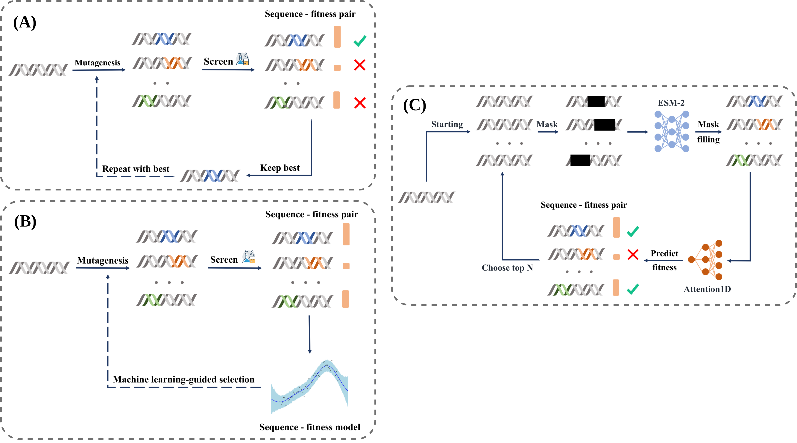

<div align="center">

# Protein Design by Directed Evolution guided by Large Language Models
</div>

Contributors:
* Tran Van Trong Thanh
* Truong Son Hy (PI / Correspondent)

## Table of Contents:

- [Introduction](#introduction)
- [Structure Description](#structure-description)
- [Installation](#installation)
- [Usage](#usage)
    - [Training](#train)
    - [Inference](#inference)
- [Citation](#citation)
- [License](#license)

## Introduction
This is the official repository for paper [Protein Design by Directed Evolution guided by Large Language Models]().

|  | 
|:--:| 
| *Our pipeline **(C)**, in comparision to traditional pipeline **(A)** and common ML-guided pipeline **(B)*** |

## Structure description

Our repository is structured as follows:
```python
.
  |-assets
  |-README.md
  |-LICENSE
  |-preprocessed_data        # training data
  |-requirements.txt   
  |-scripts
  |  |-train_decoder.py      # trains oracle
  |  |-run_de.sh             # Shell file to run
  |  |-run_discrete_de.py    # Python file to run
  |  |-preprocess            # contains codes to preprocess data
  |-exps
  |  |-results               # results stored here
  |  |-logs                  # logs stored here
  |  |-checkpoints           # checkpoints stored here
  |-setup.py
  |-de                       # contains main source code
```

## Installation

You should have Python 3.10 or higher. I highly recommend creating a virtual environment like venv or conda. If so, run the below commands to install:

```shell
git clone https://github.com/HySonLab/Directed_Evolution.git 
cd Directed_Evolution 

conda create -n mlde python=3.10 -y 
conda activate mlde

pip install -e .
```

## Usage

### Train decoder

To train the oracle (i.e., Attention1D) on certain dataset (e.g., AAV), simply run:
```shell
python train_decoder.py \
    --data_file /path/to/AAV.csv \
    --dataset_name AAV \
    --pretrained_encoder facebook/esm_t12_35M_UR5D \
    --dec_hidden_dim 1280 \
    --batch_size 256 \
    --ckpt_path /path/to/ckpt_to_continue_from \
    --devices 0 \
    --grad_accum_steps 1 \
    --lr 5e-5 \
    --num_epochs 50 \
    --num_ckpts 2 \
```
If you want to train the model without using WandB, just prepending `WANDB_DISABLED=True` to the command like below

```shell
WANDB_DISABLED=True python train_decoder.py ...
```

Arguments list:
```shell
options:
  -h, --help            show this help message and exit
  --data_file DATA_FILE
                        Path to data directory.
  --dataset_name DATASET_NAME
                        Name of trained dataset.
  --pretrained_encoder PRETRAINED_ENCODER
                        Path to pretrained encoder.
  --dec_hidden_dim DEC_HIDDEN_DIM
                        Hidden dim of decoder.
  --batch_size BATCH_SIZE
                        Batch size.
  --ckpt_path CKPT_PATH
                        Checkpoint of model.
  --devices DEVICES     Training devices separated by comma.
  --output_dir OUTPUT_DIR
                        Path to output directory.
  --grad_accum_steps GRAD_ACCUM_STEPS
                        No. updates steps to accumulate the gradient.
  --lr LR               Learning rate.
  --num_epochs NUM_EPOCHS
                        Number of epochs.
  --wandb_project WANDB_PROJECT
                        WandB project's name.
  --seed SEED           Random seed for reproducibility.
  --set_seed_only       Whether to not set deterministic flag.
  --num_workers NUM_WORKERS
                        No. workers.
  --num_ckpts NUM_CKPTS
                        Maximum no. checkpoints can be saved.
  --log_interval LOG_INTERVAL
                        How often to log within steps.
  --precision {highest,high,medium}
                        Internal precision of float32 matrix multiplications.
```

### Inference

After having oracle's checkpoint corresponding to a dataset (e.g., AAV), you can generate novel proteins by running:
```shell
python run_discrete_de.py \
    --wt DEEEIRTTNPVATEQYGSVSTNLQRGNR
    --wt_fitness -100 \
    --n_steps 60 \
    --population 128 \
    --num_proposes_per_var 4 \
    --k 1 \
    --rm_dups \
    --population_ratio_per_mask 0.6 0.4 \
    --pretrained_mutation_name facebook/esm2_t12_35M_UR50D \
    --dec_hidden_size 1280 \
    --predictor_ckpt_path /path/to/ckpt \
    --verbose \
    --devices 0 \
```

Arguments list:
```shell
options:
  -h, --help            show this help message and exit
  --data_file DATA_FILE
                        Path to data file.
  --wt WT               Amino acid sequence.
  --wt_fitness WT_FITNESS
                        Wild-type sequence's fitness.
  --n_steps N_STEPS     No. steps to run directed evolution.
  --population POPULATION
                        No. population per step.
  --num_proposes_per_var NUM_PROPOSES_PER_VAR
                        Number of proposed mutations for each variant in the pool.
  --k K                 Split sequence into multiple tokens with length `k`.
  --rm_dups             Whether to remove duplications in the proposed candidate pool.
  --population_ratio_per_mask POPULATION_RATIO_PER_MASK [POPULATION_RATIO_PER_MASK ...]
                        Population ratio to run per masker.
  --pretrained_mutation_name PRETRAINED_MUTATION_NAME
                        Pretrained model name or path for mutation checkpoint.
  --dec_hidden_size DEC_HIDDEN_SIZE
                        Decoder hidden size (for conditional task).
  --predictor_ckpt_path PREDICTOR_CKPT_PATH
                        Path to fitness predictor checkpoints.
  --num_masked_tokens NUM_MASKED_TOKENS
                        No. masked tokens to predict.
  --mask_high_importance
                        Whether to mask high-importance token in the sequence.
  --verbose             Whether to display output.
  --seed SEED           Random seed.
  --set_seed_only       Whether to enable full determinism or set random seed only.
  --result_dir RESULT_DIR
                        Directory to save result csv file.
  --save_name SAVE_NAME
                        Filename of the result csv file.
  --devices DEVICES     Devices, separated by commas.
```

## Citation
If our paper aids your work, please kindly cite our paper using the following bibtex
```bibtex
@article {Tran2023.11.28.568945,
	author = {Trong Thanh Tran and Truong Son Hy},
	title = {Protein Design by Directed Evolution Guided by Large Language Models},
	elocation-id = {2023.11.28.568945},
	year = {2023},
	doi = {10.1101/2023.11.28.568945},
	publisher = {Cold Spring Harbor Laboratory},
	abstract = {Directed evolution, a strategy for protein engineering, optimizes protein properties (i.e., fitness) by a rigorous and resource-intensive process of screening or selecting among a vast range of mutations. By conducting an in-silico screening of sequence properties, machine learning-guided directed evolution (MLDE) can expedite the optimization process and alleviate the experimental workload. In this work, we propose a general MLDE framework in which we apply recent advancements of Deep Learning in protein representation learning and protein property prediction to accelerate the searching and optimization processes. In particular, we introduce an optimization pipeline that utilizes Large Language Models (LLMs) to pinpoint the mutation hotspots in the sequence and then suggest replacements to improve the overall fitness. Our experiments have shown the superior efficiency and efficacy of our proposed framework in the conditional protein generation, in comparision with traditional searching algorithms, diffusion models, and other generative models. We expect this work will shed a new light on not only protein engineering but also on solving combinatorial problems using data-driven methods. Our implementation is publicly available at https://github.com/HySonLab/Directed_EvolutionCompeting Interest StatementThe authors have declared no competing interest.},
	URL = {https://www.biorxiv.org/content/early/2023/11/29/2023.11.28.568945},
	eprint = {https://www.biorxiv.org/content/early/2023/11/29/2023.11.28.568945.full.pdf},
	journal = {bioRxiv}
}
```

## License

[GPL-3.0 License](./LICENSE)
